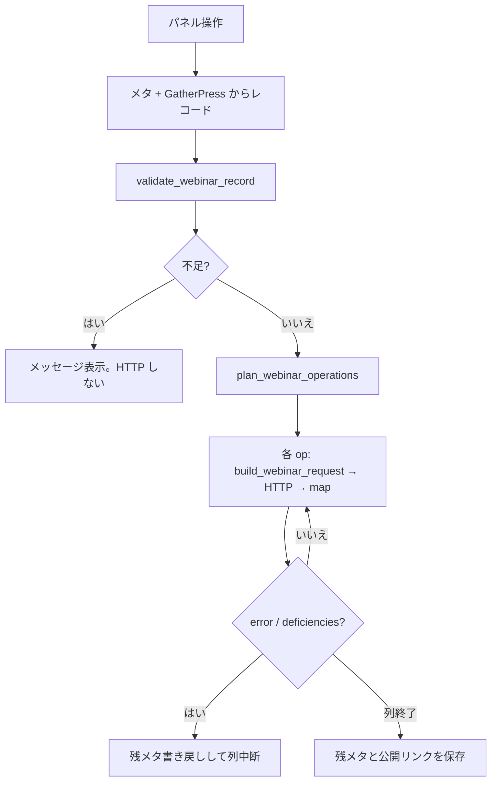

<!--
目的：「背景、課題、ユースケース、処理フロー」の明文化
-->

# S2J Webinar - コンセプト

## 背景

* 営業担当者がイベントを GatherPress で管理しつつ、Zoom Webinar を同じ編集画面から登録・更新したい。
* `kis-event-manager` の置き換え先として、イベント UI、呼び出し側、計算を分離したい。

## 課題

* Zoom REST のパス・ボディ・差分規則を WordPress 側に埋め込むと、テストと差し替えが難しい。
* トークンとメタは WordPress に残る必要がある。
* GatherPress フォークに機能を混ぜると上流追従が重い。

## 解決の方針

計算は Composer ライブラリ (純関数)。本プラグインは OAuth、HTTP、メタ、画面のアダプタ。GatherPress は公開 Slot だけで拡張します。

## 主なユースケース

| やりたいこと | 画面 | 本プラグインの動き |
| --- | --- | --- |
| Zoom をサイトに接続する | 設定 > S2J Webinar | OAuth、トークン保存 |
| Webinar を新規登録する | イベント編集パネル | レコード組立 → validate → plan → `build_webinar_request` → HTTP → map → メタ |
| 日時や録画を変えて送る | 同上 | `dirty` の場合だけ `update` 材料 |
| 登壇者だけ変える | 同上 | `synced` のまま差分 op |
| 「Zoom で開く」(`get`。再取得と同義) | 同上 | `build_webinar_request( 'get', … )` 直呼び。揮発 `start_url`。`join_url` / `webinar_uuid` 非空のときだけメタ (と `join_url` なら公開欄) を更新 |
| アンケートだけ後付け | 同上の「同期」 | `synced` + Survey の `ready` なら `attach_survey` のみ (専用ボタンなし) |
| 開催中を公開リンクに反映 | Webhook | セッション `started` と `Event::set_online`。`ended` では公開リンクを空にしない |

## 処理フロー (同期)

概念図です。create / update / 登壇者差分の map 成功直後に `_s2j_webinar_last_sent` / `_s2j_webinar_last_panelists` を即時永続化する点、「Zoom で開く」が本図と別経路である点の正本は [sync_execution_spec.md](./sync_execution_spec.md) です。サービス側の列順・失敗中断は [usage_spec](https://github.com/stein2nd/s2j-webinar-service/blob/main/docs/interfaces/usage_spec.md)。

## 関連

* 概要: [overview.md](./overview.md)
* 原則: [principles.md](./principles.md)
